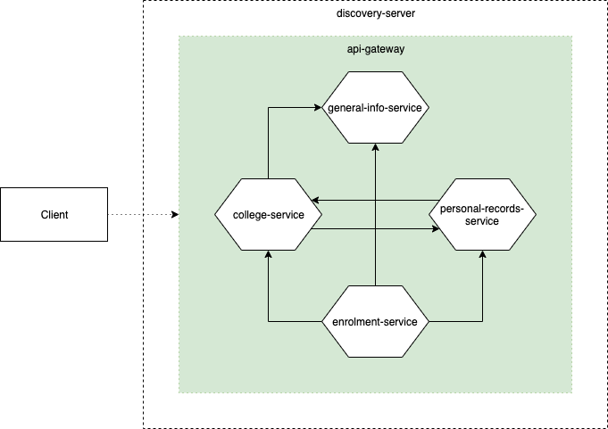

# 1. Overview
The api-gateway serves as the single entry point for all clients wanting to access the services. It basically does the routing of client calls to the appropriate services, and could apply filters and add data to the requests as needed.

It's common for microservices to be very granuralized. The purpose of the api-gateway is to unify client requests to potentially multiple services in a single common point where common logic could be applied (e.g. authentication). In addition, services need to be hidden from clients and should almost never expose their IPs. This is achieved by using [Spring Cloud Gateway](https://cloud.spring.io/spring-cloud-gateway/reference/html/), following the [API Gateway Pattern](https://microservices.io/patterns/apigateway.html) of Microservices patterns.



# 2. Accessing the Services
With services being routed by the api-gateway, there is only a single domain to call for client requests. As set up, the domain to use will be `http://localhost:18000` (given a local testing environment), appended with the necessary API's path to call.

For example, if you want all colleges from the Generic University, you request to the college-service via the `curl` command below. Note that the domain is that of the api-gateway, which is in charge of routing the `api/v1/college` path to the college service.
```json
curl http://localhost:18000/api/v1/college

{
    "response": {
        "colleges": [
            {
                "id": 1,
                "name": "College of Arts and Science"
            },
            {
                "id": 2,
                "name": "College of Commerce"
            },
            {
                "id": 3,
                "name": "College of Engineering"
            },
            {
                "id": 4,
                "name": "College of Education"
            },
            {
                "id": 5,
                "name": "College of Nursing"
            },
            {
                "id": 6,
                "name": "College of Information and Technology"
            }
        ]
    },
    "meta": {
        "message": "Query returned 6 results!",
        "timestamp": "2020-01-09T14:45:33.389+0000"
    }
}
```

